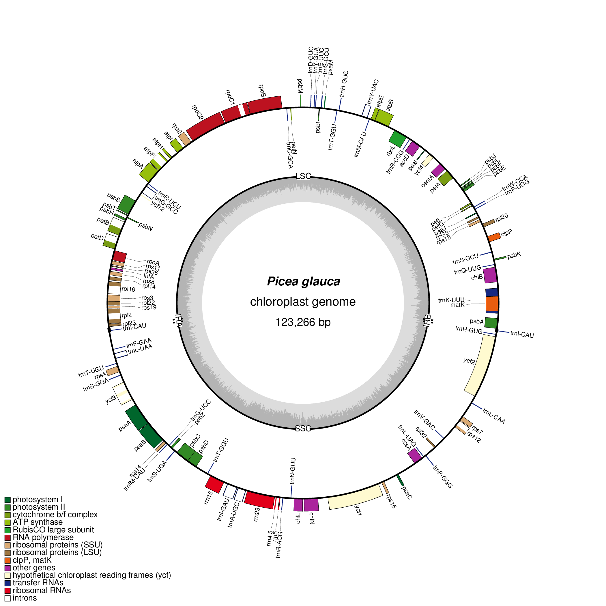

Annotate the plastid genome of white spruce (Picea glauca)
================================================================================

+ [NCBI GenBank KT634228](http://www.ncbi.nlm.nih.gov/nuccore/KT634228)
+ [GFF of the annotations](https://github.com/sjackman/pgcpdna/blob/master/pg29-plastid-manual.gff)
+ [Blog post](http://sjackman.ca/2016-02-13-white-spruce-organelles/)
+ [Poster doi:10.7490/f1000research.1112919.1](http://f1000research.com/posters/5-2072)

Shaun D Jackman, et al. (2016)
Organellar Genomes of White Spruce (*Picea glauca*): Assembly and Annotation.
*Genome Biology and Evolution*, [doi:10.1093/gbe/evv244](http://gbe.oxfordjournals.org/content/8/1/29)

